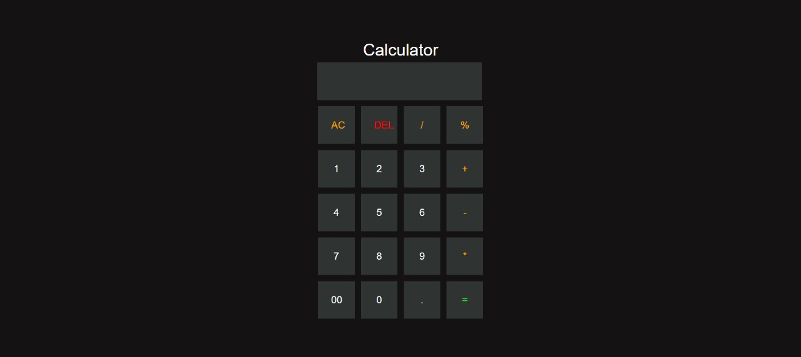

# Calculator App

A simple and elegant calculator application built with HTML, CSS, and JavaScript.

## Features
- Basic arithmetic operations.
- Keyboard input support.
- Stylish UI with color-coded buttons.

## Preview

## Technologies Used
- HTML5
- CSS3
- JavaScript
